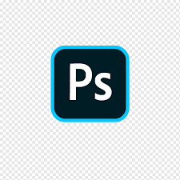

# Hi there! I'm Aswin 👋

## Backend Developer
 
### Full stack Developer, with expertise in NodeJS, Laravel excelling in building robust RESTful APIs. 

### Connect With Me:

[][LinkEdin]
 

### Skills, Languages and Tools

[][React]
[][Javascript]
[][Node]
[][Mongo]
[][Express]

[][HTML]
[][CSS]
[][JAVA]
[][C]
[][Photoshop]
[][git]
[][github]
[][vsc]
[][ecl]
[][term]
 
 

[CodePen]:https://codepen.io/aswinap13/
[LinkEdin]: https://www.linkedin.com/in/aswin-a-p/
[React]:https://react.dev/
[Node]:https://nodejs.org/en
[Mongo]:https://www.mongodb.com/
[Express]:https://expressjs.com/
[Photoshop]:https://www.adobe.com/in/products/photoshop.html
[C]:https://www.cprogramming.com/
[JAVA]:https://www.java.com/
[Javascript]:https://www.javascript.com/
[HTML]:https://html.com/
[CSS]:https://developer.mozilla.org/en-US/docs/Web/CSS
[ecl]:https://www.eclipse.org/
[vsc]:https://code.visualstudio.com/
[git]:https://git-scm.com/
[github]:https://github.com/
[term]:https://www.microsoft.com/en-us/p/windows-terminal/9n0dx20hk701
